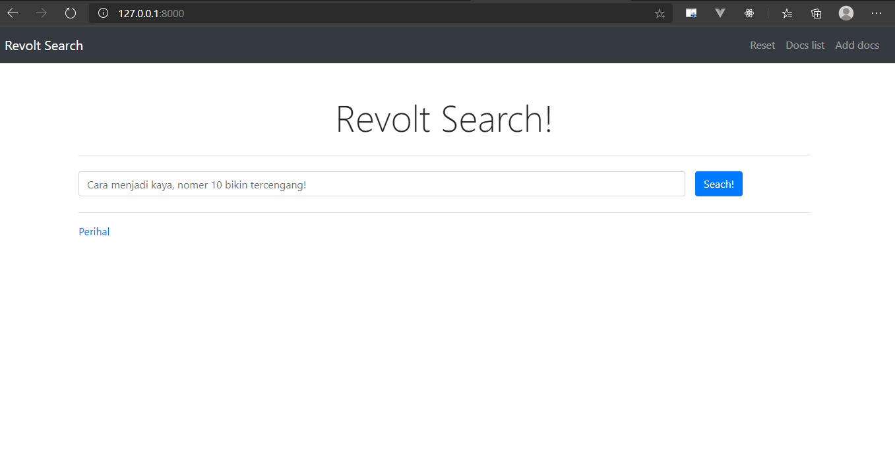
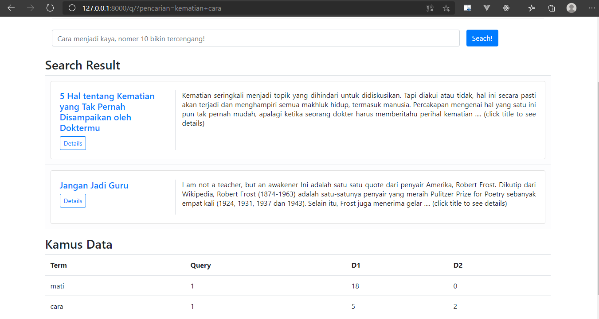

# Revolt Search!
> a revolutioner search engine!

## Table of contents
* [General info](#general-info)
* [Screenshots](#screenshots)
* [Technologies](#technologies)
* [Setup](#setup)
* [Features](#features)
* [Status](#status)
* [Inspiration](#inspiration)
* [Contact](#contact)

## General info
Aplikasi search engine dengan memanfaatkan dot product

## Screenshots



## Technologies
* Django - version 3

## Setup
Install python version 3.6.x keatas

Install dependecies
```bash
pip install -r requirements.txt
```

Untuk menjalankan web di local (pastikan terkoneksi ke internet karena ada terdapat css dan js yang diambil dari internet)
``` bash
cd src/tubes2Algeo
```
``` bash
manage.py runserver
```
> buka http://127.0.0.1:8000/ di web browser

## Features
* Search
* Upload dokumen
* Reset dokumen
* tabel kamus data
* cosine similarity
* jumlah kata

## Status
Finished for now

## Inspiration
Pak Rinaldi Munir, Tubes 2 Algeo

## Contact
Created by [@hafidabiiiii](https://www.instagram.com/hafidabiiiii/), [@arsa_dg](https://www.instagram.com/arsa_dg/), [@syamilcholid](https://www.instagram.com/syamilcholid/)
